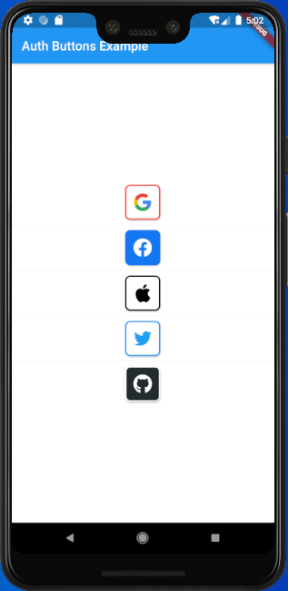
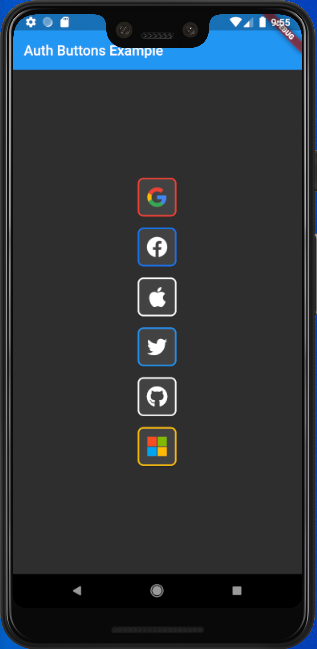
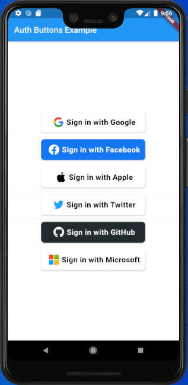
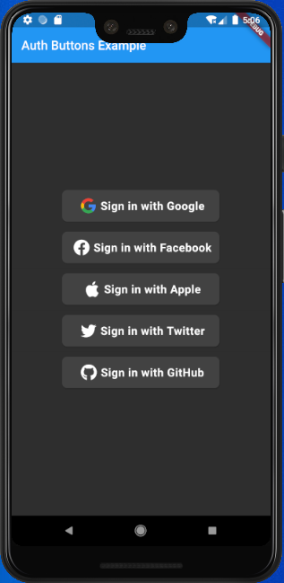

# auth_buttons
[](https://pub.dev/packages/auth_buttons)

Auth Buttons is a flutter widget library, include buttons for authenticating with the most popular 
social networks like: Google, Facebook, Apple and too other.

## Installation
1) add this to your packages pubspec.yaml file:
```yaml
dependencies:
  auth_buttons: ^0.0.4
```
2) Install it 
You can install it from the command line:
```
$ flutter pub get
```
3) Import it 
Now in Dart code, you can use:
```dart
import 'package:auth_buttons/auth_buttons.dart';
```


## Using
 
You need to use just the following code: 


```dart
GoogleAuthButton(
  onPressed: () {},
  darkMode: false,
  style: AuthButtonStyle.icon,
),
```

```dart
GoogleAuthButton(
  onPressed: () {},
  darkMode: true,
  style: AuthButtonStyle.icon,
),
```


```dart
GoogleAuthButton(
  onPressed: () {},
  darkMode: false,
),
```


```dart
GoogleAuthButton(
  onPressed: () {},
  darkMode: true,
),
```

Do same think with the other buttons, when you want customize any button 
you can do it just passing a property which you want.