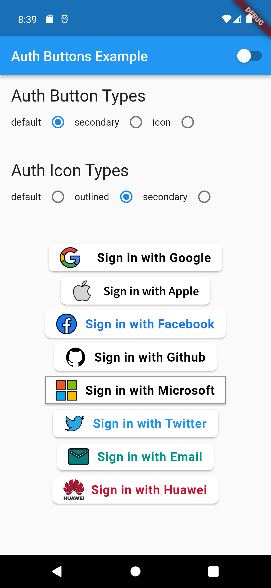
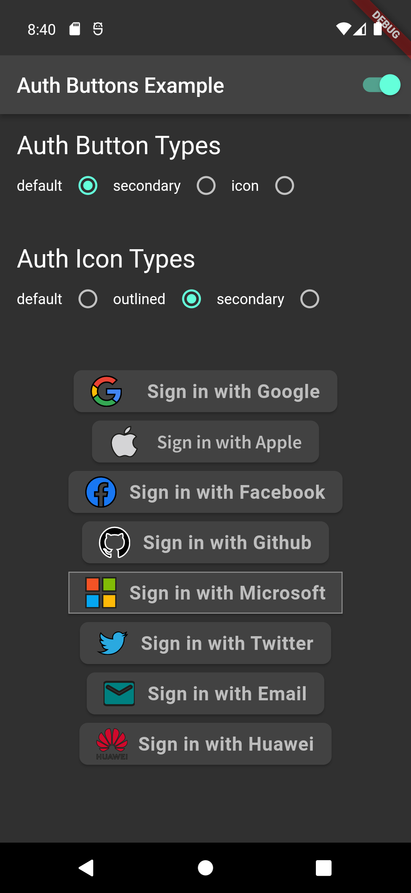
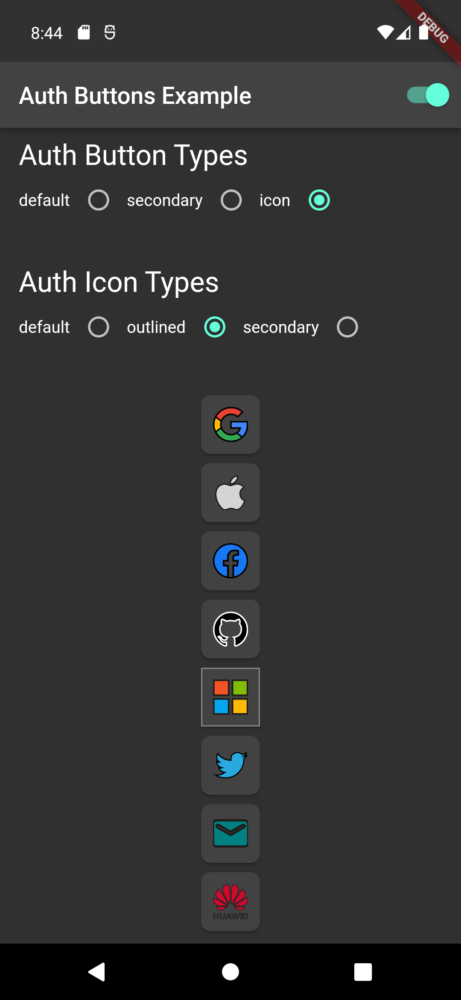
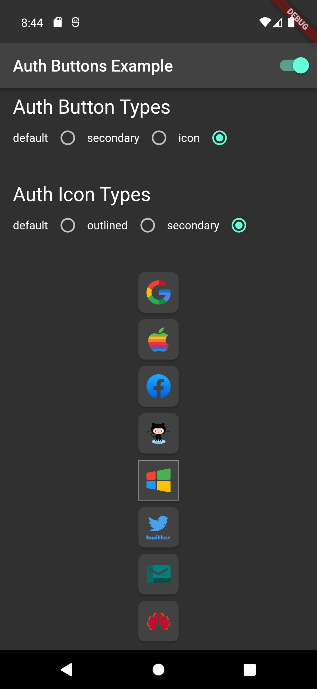
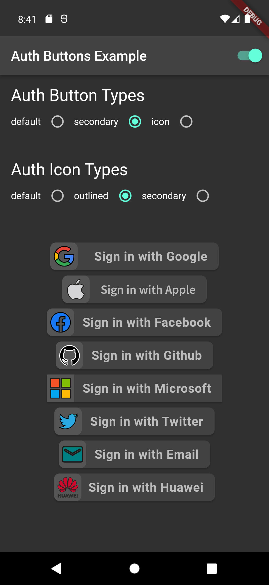
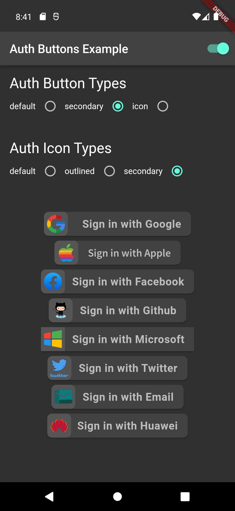

# auth_buttons
[](https://pub.dev/packages/auth_buttons)

Auth Buttons is a flutter widget library, include buttons for authenticating with the most popular 
social networks like: Google, Facebook, Apple and too other.

## Installation
1) Add this to your packages pubspec.yaml file:
```yaml
dependencies:
  auth_buttons: ^1.0.0
```
2) Install it 
You can install it from the command line:
```bash
$ flutter pub get
```
3) Import it 
Now in Dart code, you can use:
```dart
import 'package:auth_buttons/auth_buttons.dart';
```

## Recommendation

We recommend you to using `show` special when you want use some button.
`show` help you importing part of library.

```dart
import 'package:auth_buttons/auth_buttons.dart'
    show GoogleAuthButton, AuthButtonStyle;
```
We also recommend you to using the latest version.

## Overview

**`New`** new icons available.

There are three style you can choose between them:

1. [Default](#default-style)
1. [Icon](#icon-style)
1. [Secondary](#secondary-style)
  
## Using
 
You need to use just the following code: 

### Default style

```dart
GoogleAuthButton(
  onPressed: () {},
  darkMode: false, // if true second example
),
```


```dart
GoogleAuthButton(
  onPressed: () {},
  darkMode: false,
  iconStyle: AuthIconStyle.outlined,
),
```




```dart
GoogleAuthButton(
  onPressed: () {},
  darkMode: false,
  iconStyle: AuthIconStyle.secondary,
),
```


### Icon Style

```dart
GoogleAuthButton(
  onPressed: () {},
  darkMode: false,
  style: AuthButtonStyle.icon,
),
```


```dart
GoogleAuthButton(
  onPressed: () {},
  darkMode: false,
  style: AuthButtonStyle.icon,
  iconStyle: AuthIconStyle.outlined,
),
```





```dart
GoogleAuthButton(
  onPressed: () {},
  darkMode: false,
  style: AuthButtonStyle.icon,
  iconStyle: AuthIconStyle.secondary,
),
```




### Secondary Style

```dart
GoogleAuthButton(
  onPressed: () {},
  darkMode: false,
  style: AuthButtonStyle.secondary,
  iconStyle: AuthIconStyle.secondary,
),
```


```dart
GoogleAuthButton(
  onPressed: () {},
  darkMode: false,
  style: AuthButtonStyle.secondary,
  iconStyle: AuthIconStyle.outlined,
),
```





```dart
GoogleAuthButton(
  onPressed: () {},
  darkMode: false,
  style: AuthButtonStyle.secondary,
  iconStyle: AuthIconStyle.secondary,
),
```




Do same think with the other buttons, when you want customize any button 
you can do it just passing a property which you want.

Full property you can passing:

```dart
GoogleAuthButton(
  key: ValueKey(''),
  onPressed: () {},
  onLongPressed: (){},
  darkMode: false,
  rtl: false,
  buttonColor: Colors.white,
  splashColor: Colors.grey,
  shadowColor: Colors.teal,
  borderColor: Colors.red,
  borderRadius: 8.0,
  borderWidth: 2.0,
  elevation: 2.0,
  width: 280.0,
  height: 50.0,
  separator: 10.0,
  iconSize: 35.0,
  iconBackground: Colors.transparent,
  iconStyle: AuthIconStyle.outlined,
  style: AuthButtonStyle.secondary,
  padding: EdgeInsets.all(8.0),
  text: 'Sign in with Google',
  textStyle: TextStyle(
    color: Colors.black,
    fontSize: 18,
    fontWeight: FontWeight.bold,
    letterSpacing: 0.50,
  ),
),
```

[return up](#auth_buttons)
