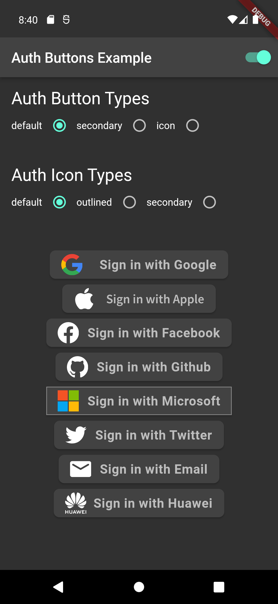
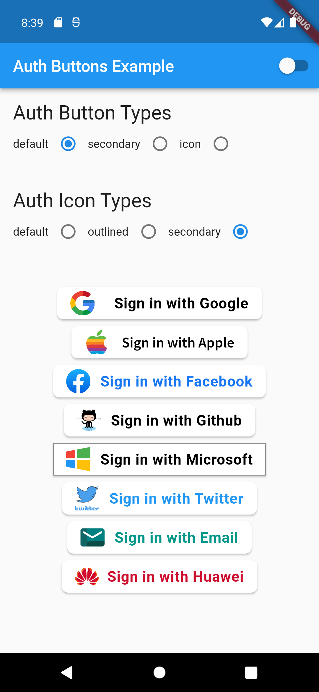
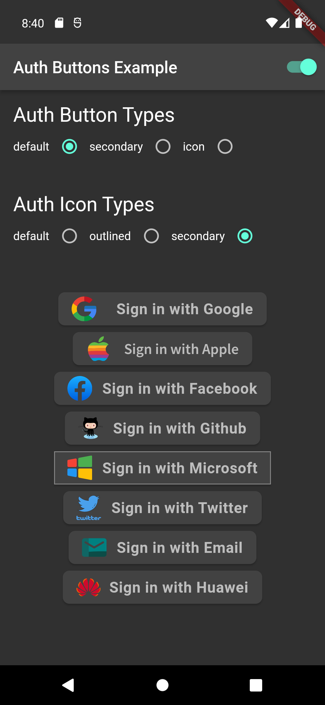
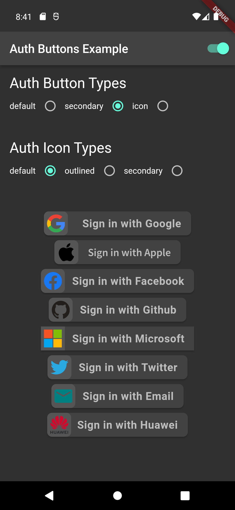

# auth_buttons
[](https://pub.dev/packages/auth_buttons)

Auth Buttons is a flutter widget library, include buttons for authenticating with the most popular 
social networks like: Google, Facebook, Apple and too other.

## Installation
1) Add this to your packages pubspec.yaml file:
```yaml
dependencies:
  auth_buttons: ^1.0.1
```
2) Install it 
You can install it from the command line:
```bash
$ flutter pub get
```
3) Import it 
Now in Dart code, you can use:
```dart
import 'package:auth_buttons/auth_buttons.dart';
```

## Recommendation

We recommend you to using `show` special when you want use some button.
`show` help you importing part of library.

```dart
import 'package:auth_buttons/auth_buttons.dart'
    show GoogleAuthButton, AuthButtonStyle, AuthButtonType, AuthIconType;
```
We also recommend you to using the latest version.

## Overview

There are three Types you can choose between them:

1. [Default](#default-type)
1. [Icon](#icon-type)
1. [Secondary](#secondary-type)
  
## Using
 
You need to use just the following code: 

### Default Type

```dart
GoogleAuthButton(
  onPressed: () {},
  darkMode: false, // if true second example
),
```
Light             |  Dark
:-------------------------:|:-------------------------:
  |  

```dart
GoogleAuthButton(
  onPressed: () {},
  darkMode: false,
  style: AuthButtonStyle(
    iconType: AuthIconType.outlined,
  ),
),
```

Light             |  Dark
:-------------------------:|:-------------------------:
  |  


```dart
GoogleAuthButton(
  onPressed: () {},
  darkMode: false,
  style: AuthButtonStyle(
    iconType: AuthIconType.secondary,
  ),
),
```

Light             |  Dark
:-------------------------:|:-------------------------:
  |  


### Icon Type

```dart
GoogleAuthButton(
  onPressed: () {},
  darkMode: false,
  style: AuthButtonStyle(
    buttonType: AuthButtonType.icon,
  ),
),
```

Light             |  Dark
:-------------------------:|:-------------------------:
  |  


```dart
GoogleAuthButton(
  onPressed: () {},
  darkMode: false,
  style: AuthButtonStyle(
    buttonType: AuthButtonType.icon,
    iconType: AuthIconType.outlined,
  ),
),
```

Light             |  Dark
:-------------------------:|:-------------------------:
  |  


```dart
GoogleAuthButton(
  onPressed: () {},
  darkMode: false,
  style: AuthButtonStyle(
    buttonType: AuthButtonType.icon,
    iconType: AuthIconType.secondary,
  ),
),
```

Light             |  Dark
:-------------------------:|:-------------------------:
  |  

### Secondary Secondary

```dart
GoogleAuthButton(
  onPressed: () {},
  darkMode: false,
  style: AuthButtonStyle(
    buttonType: AuthButtonType.secondary,
  ),
),
```

Light             |  Dark
:-------------------------:|:-------------------------:
  |  

```dart
GoogleAuthButton(
  onPressed: () {},
  darkMode: false,
  style: AuthButtonStyle(
    buttonType: AuthButtonType.secondary,
    iconType: AuthIconType.outlined,
  ),
),
```

Light             |  Dark
:-------------------------:|:-------------------------:
  |  

```dart
GoogleAuthButton(
  onPressed: () {},
  darkMode: false,
  style: AuthButtonStyle(
    buttonType: AuthButtonType.secondary,
    iconType: AuthIconType.secondary,
  ),
),
```

Light             |  Dark
:-------------------------:|:-------------------------:
  |  

Do same think with the other buttons, when you want customize any button 
you can do it just passing a property which you want.

Full property you can passing:

```dart
GoogleAuthButton(
  key: const ValueKey<String>(''),
  onPressed: () {},
  onLongPress: () {},
  text: 'Sign in with Google',
  darkMode: false,
  isLoading: isLoading,
  rtl: false,
  style: AuthButtonStyle(
    buttonColor: Colors.white,
    splashColor: Colors.grey.shade100,
    shadowColor: Colors.grey,
    borderColor: Colors.red,
    borderRadius: 8.0,
    borderWidth: 2.0,
    elevation: 2.0,
    width: 280.0,
    height: 50.0,
    separator: 10.0,
    iconSize: 35.0,
    iconBackground: Colors.transparent,
    iconType: AuthIconType.outlined,
    buttonType: AuthButtonType.secondary,
    padding: const EdgeInsets.all(8.0),
    textStyle: const TextStyle(
      color: Colors.black,
      fontSize: 18,
      fontWeight: FontWeight.bold,
      letterSpacing: 0.50,
    ),
    progressIndicatorColor: Colors.red,
    progressIndicatorValueColor: Colors.amber,
    progressIndicatorStrokeWidth: 2.0,
  ),
),
```

[return up](#auth_buttons)
